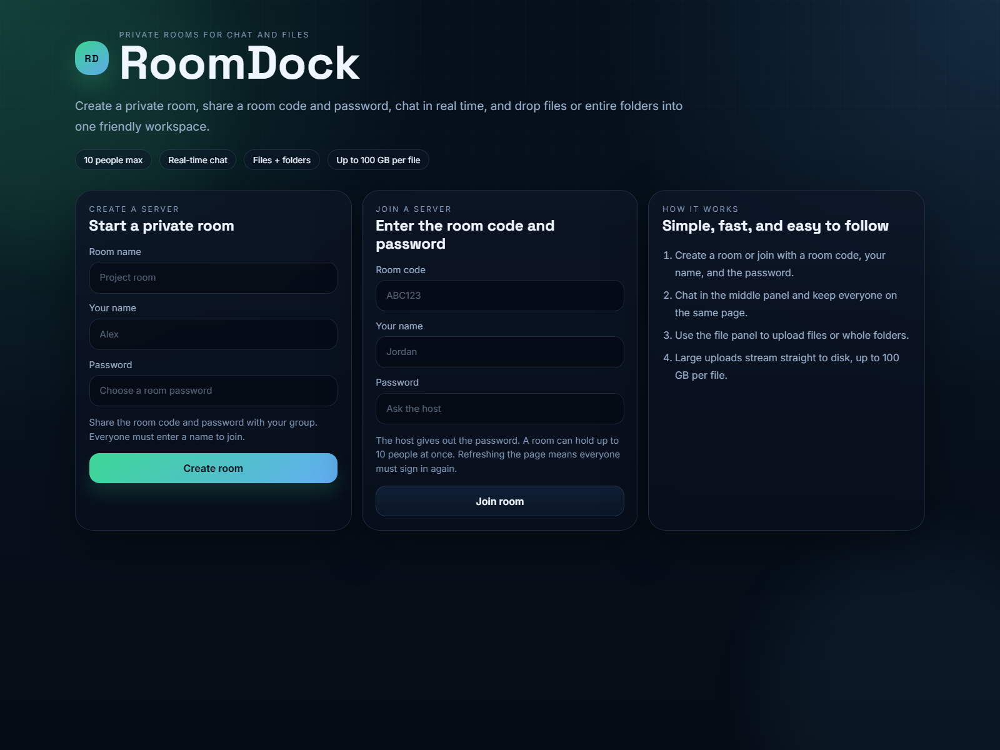
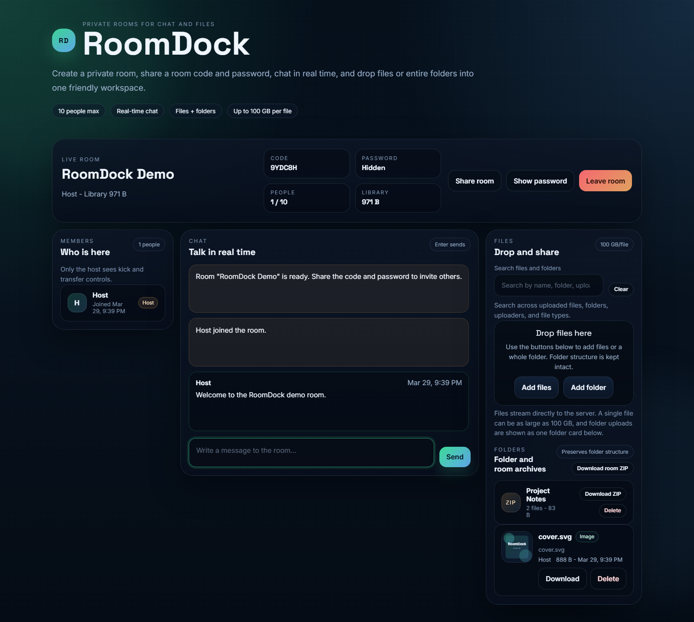
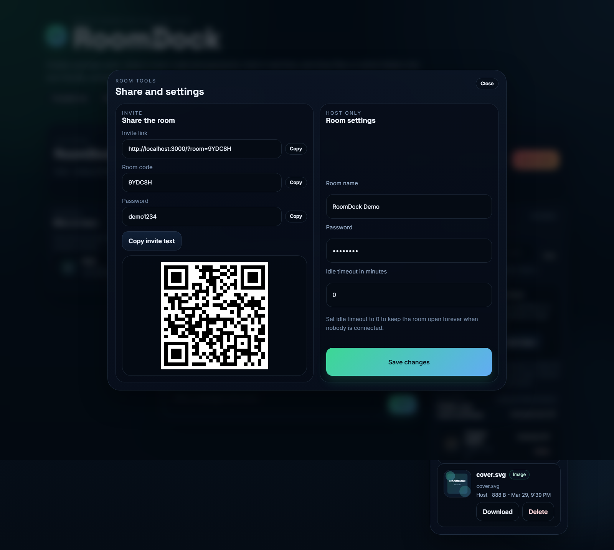

# RoomDock

RoomDock is a private room web app for:

- Real-time chat
- File uploads
- Folder uploads
- Image previews
- Room invites with link and QR code
- Host controls for room settings, file management, and member management

It is built with Node.js, Express, Socket.IO, and plain HTML/CSS/JavaScript.

## Screenshots

### Landing page



### Room dashboard



### Share and settings



## How It Works

RoomDock uses a private room model:

1. The host creates a room with a room name and password.
2. Other people join using the room code, their name, and the password.
3. The room supports up to 10 connected users.
4. Chat updates in real time.
5. Uploaded files and folders are stored on the server disk.
6. The app saves room data so rooms can survive a restart.

Important detail:

- Refreshing the page does not keep a user signed in.
- After a refresh, the user must enter the room code, name, and password again.
- This is intentional so unknown users do not re-enter by accident.

## What Gets Stored

RoomDock stores data in the `data` folder:

- `data/uploads` contains the real uploaded files and folder contents.
- `data/rooms.json` stores room info, passwords, chat history, and file metadata.

That means:

- Deleting `data/uploads` frees the most disk space, but removes uploaded files.
- Deleting `data/rooms.json` resets all rooms, chat, and file lists.
- If `data/uploads` is deleted but `data/rooms.json` stays, the room metadata will still exist, but the uploads will be gone.

## Features

- Create a private room
- Join with room code, name, and password
- Real-time chat
- Upload single files
- Upload folders
- Keep folder structure intact
- View folder uploads as one folder card
- Download a single file
- Preview images in the browser
- Search files and folders
- Download one folder as a ZIP
- Download the whole room as a ZIP
- Host can rename the room
- Host can change the password
- Host can set an idle auto-expire timer
- Host can delete files and folders
- Host can kick members
- Host can transfer host rights
- Share invite link and QR code

## Requirements

- Node.js 18 or newer
- npm

## Install

```bash
npm install
```

## Run

```bash
npm start
```

The app runs on:

```bash
http://localhost:3000
```

You can also set a custom port:

```bash
PORT=4000 npm start
```

## How To Use It

### 1. Create a room

1. Open the app.
2. Enter a room name.
3. Enter your name.
4. Choose a password.
5. Click **Create room**.

You will get a room code that other people can use to join.

### 2. Join a room

1. Enter the room code.
2. Enter your name.
3. Enter the password from the host.
4. Click **Join room**.

### 3. Chat

- Type a message in the chat box.
- Press Enter to send.
- Shift + Enter makes a new line.

### 4. Upload files

1. Click **Add files** or drag files into the upload area.
2. The files upload to the server.
3. Everyone in the room can download them.

### 5. Upload a folder

1. Click **Add folder**.
2. Pick a folder with files inside it.
3. RoomDock keeps the folder structure.
4. The UI shows one folder card instead of listing every inner file separately.
5. People can download the folder as a ZIP.

### 6. Search uploads

- Use the search bar in the Files panel.
- Search by file name, folder name, uploader name, file type, or MIME type.

### 7. Share the room

- Click **Share room**.
- Copy the invite link, room code, or invite text.
- Use the QR code on phones or tablets.

### 8. Host tools

If you are the host, the room tools modal also lets you:

- Rename the room
- Change the password
- Set an idle expiry timer
- Delete files
- Delete folders
- Kick members
- Transfer host rights

### 9. Download archives

- Use **Download room ZIP** to download everything in the room.
- Use the folder card’s **Download ZIP** button to download one folder.

## File and Folder Storage

Uploads are saved on disk under `data/uploads`.

The server stores each uploaded file with:

- A unique file ID
- The original file name
- The relative path inside a folder upload
- The uploader name
- The file size
- The MIME type

For folder uploads:

- Each inner file is still stored separately on disk.
- The app groups them using folder metadata.
- That is why the UI can show one folder card and still support ZIP downloads.

## Cleanup And Reset

### Free disk space

If the server disk is getting full, the biggest space usage is usually `data/uploads`.

You can safely delete old uploads if you no longer need them.

### Full reset

If you want to wipe everything:

1. Stop the server.
2. Delete `data/uploads`.
3. Delete `data/rooms.json`.
4. Start the server again.

RoomDock will recreate the data files when needed.

## Project Structure

```text
server.js
public/
  index.html
  app.js
  styles.css
data/
  rooms.json
  uploads/
```

## Notes

- The app keeps room state in memory while the server is running.
- Room data is also persisted to `data/rooms.json`.
- Uploaded files remain on disk until you delete them.
- A room can hold up to 10 users at once.
- A single file upload can be up to 100 GB.

## Troubleshooting

### I refreshed and got logged out

That is expected. Re-enter the room code, name, and password.

### Uploads are not showing

- Check that the server is still running.
- Check that the files still exist in `data/uploads`.
- If `data/uploads` was deleted, the room file list will not have anything to show.

### The disk is full

- Delete old files in `data/uploads`.
- Or move the `data` folder to a bigger drive.
- `data/rooms.json` is small, so it usually does not free much space by itself.

## Scripts

```bash
npm start
npm run dev
```

Both scripts start the same server.

## Go Online

- https://adhrit-roomvault-storage-sharing.onrender.com
